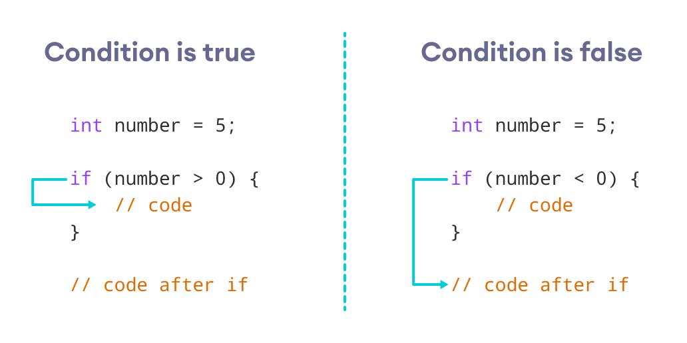

# # 🤩Instrukcje Warunkowe🤗
## Warunki
🎯 A == B - jeśli A jest równe B jest to prawda, jeśli nie jest to Fałsz</br>
🎯 A != B - jeśli A jest różne B jest to prawda, jeśli nie jest to fałsz</br>
🎯 A < B - jeśli A jest mniejsze od B jest to prawda, jeśli nie jest to fałsz</br>
🎯 A > B - jeśli A jest większe od B jest to prawda, jeśli nie jest to fałsz</br>
🎯 A <= B - jeśli A jest mniejsze lub równe B jest to prawda, jeśli nie jest to fałsz</br>
🎯 A >= B - jeśli A jest większa lub równe B jest to prawda, jeśli nie jest to fałsz

***
### *Przykład-1*:

***
### *Przykład-2*:
```c++
#include <iostream>

using namespace std;

int main()
{
	int haslo = 1234;
    int twoje_haslo;
    cin>>twoje_haslo;
	if(twoje_haslo == haslo)
	{
		cout<<"Gratuluje zalogowales sie do banku";
	}
	else{
		cout<<"Bledne haslo";
	}
	return 0;
}
```
***
### Przykład-3:

```c++
#include <iostream>

using namespace std;

int main()
{
	int wynik = 50;
    int a;
	int b;
	cout<<"Podaj 1. liczbe: ";
    cin>>a;
	cout<<"Podaj 2. liczbe: ";
	cin>>b;

	if(a+b < wynik)
	{
		cout<<"wynik mniejszy";
	}
	else if(a+b > wynik){
		cout<<"wynik wiekszy";
	}
	return 0;
}
```
